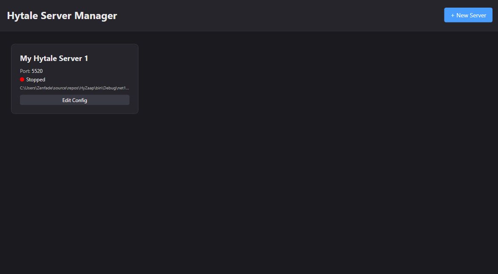
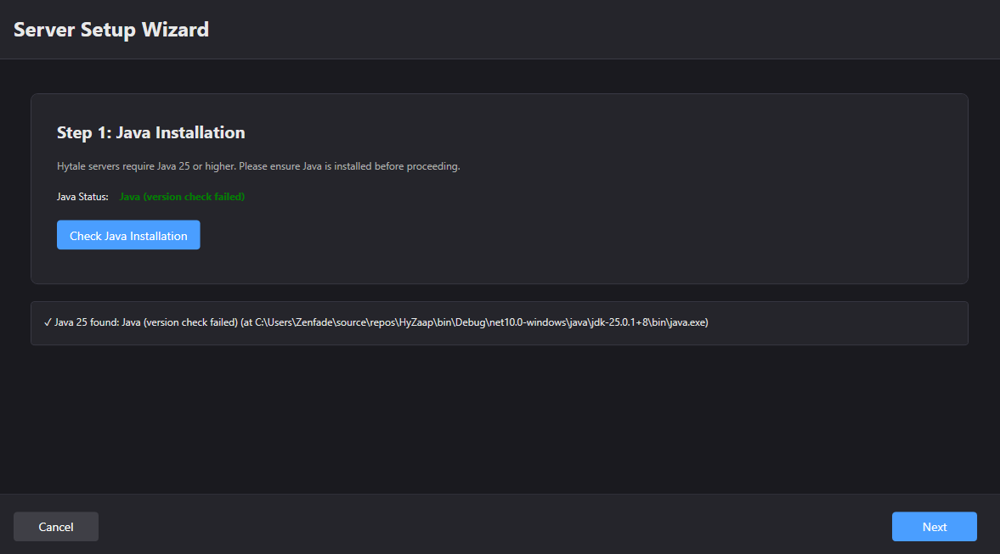
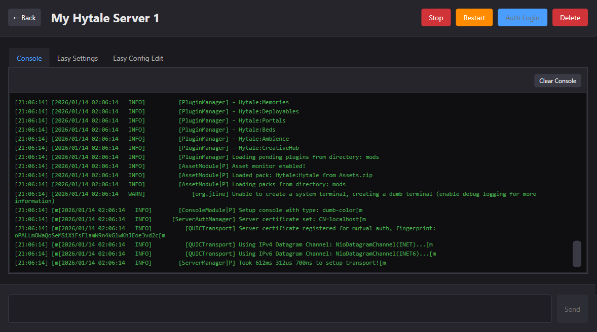

# HyZaap

Windows desktop application for managing Hytale game servers. Built with WPF and .NET 10.0.

## Screenshots








## Features

- Multi-server management from a single interface
- Automated server setup wizard
- Automatic Java 25 download and installation
- Real-time console output with command execution
- Easy and advanced configuration editors
- OAuth2 device authentication flow
- Process reattachment when reopening the application

## Requirements

- Windows 10 or later
- .NET 10.0 Desktop Runtime (included in releases)
- Java 25 (automatically downloaded if not found)
- Internet connection for initial setup

## Installation

1. Download the latest release from [Releases](https://github.com/openseb/HyZaap/releases)
2. Extract `HyZaap-vX.X.X.zip` to your desired location
3. Run `HyZaap.exe`

## Usage

### First Time Setup

1. Launch HyZaap
2. Click "Add Server"
3. Follow the setup wizard:
   - Check or download Java 25
   - Configure server name and directory
   - Download server files (Hytale Downloader or manual copy)
   - Configure server settings (port, memory, etc.)
   - Review and create server

### Managing Servers

**Starting a Server:**
- Select a server from the list
- Click "Start Server"
- Monitor console output in real-time

**Stopping a Server:**
- Click "Stop Server" button or use console command `/stop`

**Configuring a Server:**
- Easy Mode: Use the user-friendly settings editor
- Advanced Mode: Edit JSON configuration directly
- Click "Save" or "Save & Restart" to apply changes

**Authentication:**
1. Start your server
2. Click "Auth Login"
3. Complete authentication in browser
4. Profile will be automatically selected

**Sending Commands:**
- Type command in the console input field
- Press Enter or click "Send"

## Building

### Prerequisites

- .NET 10.0 SDK
- Visual Studio 2022 or later (recommended)

### Build Steps

```bash
git clone https://github.com/openseb/HyZaap.git
cd HyZaap
dotnet restore
dotnet build --configuration Release
```

### Creating a Release Build

Use the included PowerShell script:

```powershell
# Patch version bump (1.0.0 → 1.0.1)
.\build-release.ps1

# Minor version bump (1.0.0 → 1.1.0)
.\build-release.ps1 -BumpType minor

# Major version bump (1.0.0 → 2.0.0)
.\build-release.ps1 -BumpType major
```

For manual builds:

```bash
dotnet publish -c Release -r win-x64 --self-contained true -p:PublishSingleFile=true -p:IncludeNativeLibrariesForSelfExtract=true
```

Output will be in `bin/Release/net10.0-windows/win-x64/publish/`

## Project Structure

```
HyZaap/
├── Models/              # Data models
├── ViewModels/         # MVVM ViewModels
├── Views/              # XAML views
├── Services/           # Business logic services
├── Converters/         # XAML value converters
├── Screenshots/        # Application screenshots
└── HyZaap.csproj       # Project file
```

## Configuration

Server configurations are stored in `servers.json` in the application directory.

Servers are stored in: `<Application Directory>/servers/<Server Name>/`

Java 25 is downloaded to: `<Application Directory>/java/jdk-25.0.1+8/`

## Troubleshooting

**Java Not Detected:**
- Use the download button in the setup wizard
- Verify Java path in server settings
- Restart the application

**Server Won't Start:**
- Verify Java 25 is installed
- Check server files are present
- Review console output for errors
- Ensure port is not in use

**Authentication Issues:**
- Complete browser authentication flow
- Check internet connection
- Verify server is running

**Console Not Showing Output:**
- Restart server to restore console functionality
- Check server process is running

## Contributing

Contributions are welcome. Please submit a Pull Request.

1. Fork the repository
2. Create your feature branch
3. Commit your changes
4. Push to the branch
5. Open a Pull Request

## License

This project is licensed under the MIT License - see [LICENSE.txt](LICENSE.txt) for details.
